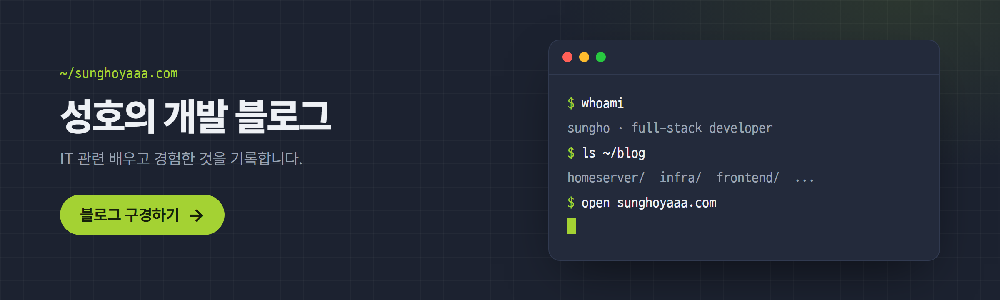

## 📝 Recent Posts
<!-- BLOG-POST-LIST:START -->
- [라즈베리파이 홈서버에 Garage로 이미지 파일 서버 만들기](https://sunghoyaaa.com/blog/2026-09-23/garage-image-server/)
- [opacity만 0으로 줬는데 클릭은 왜 계속 될까 — pointer-events 이야기](https://sunghoyaaa.com/blog/2026-09-08/pointer-events-modal-backdrop-bug/)
- [GitHub Actions에서 ARM64 Docker 빌드가 QEMU 크래시로 멈췄던 이야기](https://sunghoyaaa.com/blog/2026-09-06/github-actions-arm64-qemu-crash/)
- [홈 서버 구축하면서 배운 것들](https://sunghoyaaa.com/blog/2026-08-22/home-server-setup/)
<!-- BLOG-POST-LIST:END -->

## 🛠 TECH STACK

### Frontend

  
  
  

### Mobile Development

  

### Backend

 
   
  

### Database

  
  
  
  

### Web Hosting & Deployment Expertise

  
  
  
  
  

